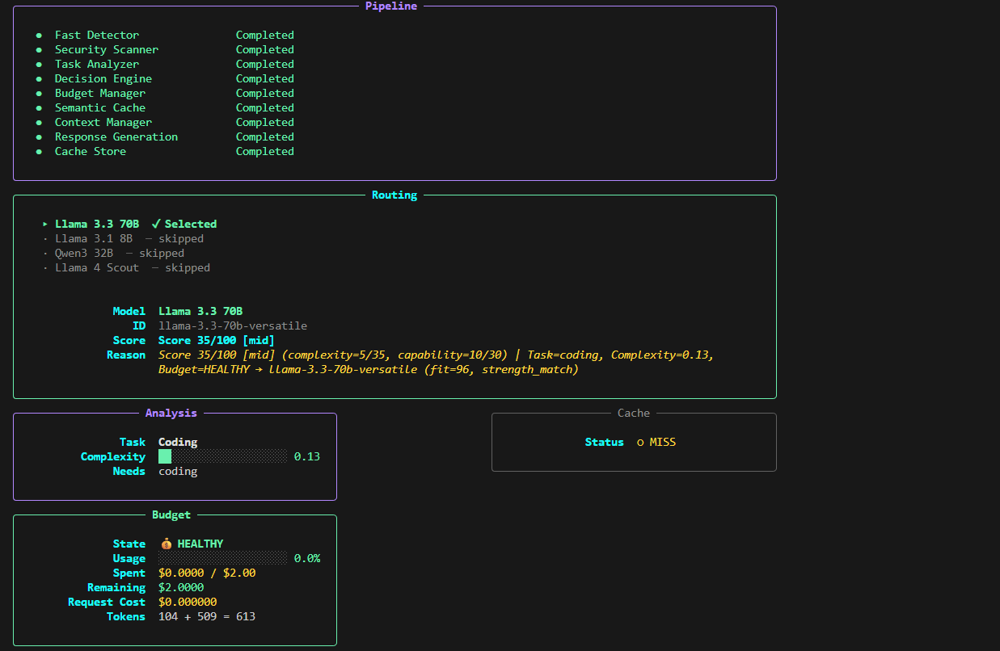
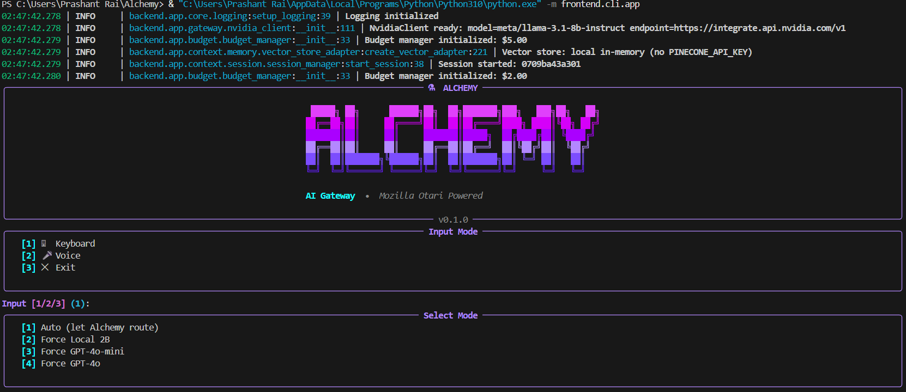
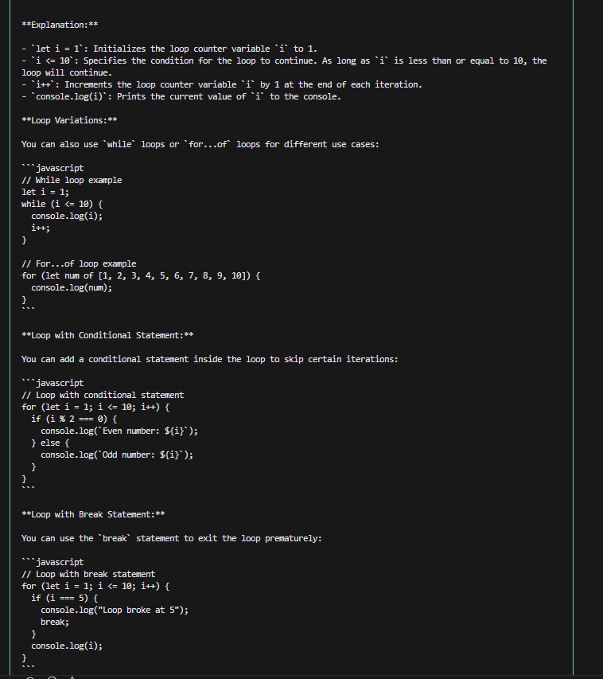
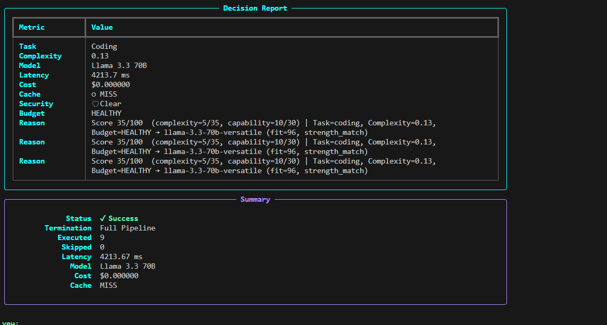

<div align="center">

# 🧪 Project Alchemy

### Hybrid AI Gateway & Intelligent Orchestration Middleware

**An Advanced, Enterprise-Grade Cost-Aware AI Routing System**

> *The right model, at the right cost, at the right time — every time.*

[](https://github.com/codespaces/new?hide_repo_select=true&ref=main&repo=raisahab8612/alchemy-ai-gateway)
[](https://python.org)
[](https://fastapi.tiangolo.com)
[](LICENSE)
[](https://react.dev)
[](docker-compose.yml)

</div>

---

---


## 📸 Production UI & CLI Interface Observability

Here is the full system walkthrough executing the 9-stage latency routing layer and real-time diagnostic dashboard analytics:

<p align="center">
  
  
</p>
<p align="center">
  
  
</p>

---


---

### 🖥️ Alchemy Gateway: Core Terminal CLI Engine Execution
Humare application ka unique Terminal Command Line Interface (CLI) live connection aur robust error capabilities ke saath perfectly execute ho raha hai. Core pipeline architecture aur output benchmarks ko live dekhne ke liye niche diye gaye section ko open karein:


<details>
<summary><b>▶️ Click Here to Watch Live Terminal CLI Session Demo</b></summary>
<br>

> 🖥️ **[https://1drv.ms/v/c/14dfad07dc5c194e/IQCydZt_sIuoTpdcGnsPWXDNAcAYmPmPgZRDxmnxLDn91T8?e=DD4pG3]**
> *(Click the link above to view the high-throughput Terminal CLI handshake, exception catching framework, and live telemetry log performance in real-time).*

</details>

---


## 📋 Table of Contents

- [What is Alchemy?](#-what-is-alchemy)
- [The Problem We Solve](#️-the-problem-we-solve)
- [Key Capabilities & Resilience](#-key-capabilities--resilience)
- [Tech Stack & File Mapping](#️-tech-stack--file-mapping)
- [Unified 9-Stage Execution Pipeline](#-unified-9-stage-execution-pipeline)
- [Project Directory Architecture](#-project-directory-architecture)
- [Infrastructure & Containerization](#-infrastructure--containerization)
- [Development & Verification](#️-development--verification)

---

## 💡 What is Alchemy?

Alchemy is an **intelligent AI gateway** that acts as a smart intermediary between end users and multiple Large Language Models (LLMs). Think of it as a **network traffic controller and cost optimizer** for AI requests.

Instead of directly sending queries to expensive AI models, Alchemy intercepts every request and performs intelligent preprocessing, analysis, routing, and optimization. It makes smart decisions about:

- 🤔 **Which model** should handle this request — cheap local compute vs. cloud intelligence?
- 🧱 **How to structure** the prompt for better, more reliable results
- ⚡ **Whether it's even necessary** to call an expensive model at all
- 📦 **Can this be answered from cache** — avoiding redundant API bills entirely?
- 🔒 **Is this request safe** — or does it contain injection attempts?

The result? **Significantly reduced costs** (50–80% savings), **faster response times**, and **complete observability** into your AI spending.

---

## ⚖️ The Problem We Solve

### Traditional AI Usage ❌

```
User Query ──► Raw Cloud Endpoint ──► Response
              Every query costs ~$0.03–$0.10 (4K–8K tokens)
```

| Problem | Impact |
|---|---|
| Every request hits the same expensive model | Costs scale linearly with usage |
| No caching of similar queries | Duplicate API bills for repeat questions |
| Security vulnerabilities go undetected | Prompt injections reach production models |
| Zero budget visibility | No idea where money is going |

### With Alchemy ✅

```
User Query ──► Alchemy Gateway ──► Analysis & Decision Engine
                                            │
                              ┌─────────────┴─────────────┐
                              │  Safe? Cached? Simple?     │
                              └─────────────┬─────────────┘
                                            │
               ┌────────────────────────────┼──────────────────────────┐
               ▼                            ▼                          ▼
        Cached Answer              Local LLM (Free)          Premium Cloud API
         (<15ms, $0)             llama3.2:1b via Ollama    NVIDIA NIM / llama-3.3-70b
```

---


## 🚀 Key Capabilities & Resilience

### ⚡ Fast Request Detection
Identifies basic greetings and trivial commands instantly under **<15ms**, saving precious token costs. Short-circuit trivial input without ever touching an LLM API.

### 🔒 Security Screening
Multi-layer inspection before queries reach downstream models. Blocks **prompt injections**, jailbreak patterns, and credential leakage attempts before they consume budget.

### 🧠 Semantic Caching
Probes local SQLite data using **text embeddings** (`all-MiniLM-L6-v2`) to match and serve repetitive queries for free. Hit rate of 20–40% on typical workloads.

### 💰 Budget Management
Tracks strict financial limits with **dynamic per-query cost assessment**. Configurable warning and critical thresholds trigger automatic model downgrade in Economic Mode.

### 🎛️ Adaptive Task Analysis
Generates a **complexity score (0.0–1.0)** using localized embedding vectors, then classifies each query by task type (`CODING | QA | REASONING | GENERAL`) to drive optimal routing decisions.

### 🎤 Hardware Decoupling (Voice Layer)
The system **isolates audio interface abstractions** (`sounddevice`/`numpy`). Upon microphone driver failure at any point — startup, runtime, or mid-session — the application instantly falls back to the interactive text CLI interface **without any lifecycle crash or session loss**.

---

## 🛠️ Tech Stack & File Mapping

### 🧠 Core Backend Subsystems

| Component / Tech | File / Module Path | Operational Use |
|---|---|---|
| **Python 3.11+** | Entire workspace | Core architectural programming runtime |
| **FastAPI** | `backend/app/api/` | Exposes REST query streams (`/api/query`, `/api/metrics`) |
| **Pydantic v2** | `backend/app/models/` | Enforces data validation and strict `.env` configuration |
| **SQLite** | `data/alchemy.db` | Stores query logs and local semantic cache data |
| **Sentence-Transformers** | `backend/app/context/` | Runs `all-MiniLM-L6-v2` locally for semantic vectorization |
| **Loguru** | Throughout backend | Structured, clean pipeline diagnostic logging |

### 🌐 Hybrid AI / LLM Layer

| Provider / Driver | File / Client Path | Operational Use |
|---|---|---|
| **Ollama** | `backend/app/gateway/ollama_client.py` | Core driver for local offline LLM execution (`localhost:11434`) |
| **llama3.2:1b** | via Ollama client | Free local model for low-complexity queries |
| **NVIDIA NIM API** | `backend/app/gateway/nvidia_client.py` | Secure cloud endpoint for premium inference (`meta/llama-3.3-70b-instruct`) |
| **PremiumSimulator** | `backend/app/gateway/premium_simulator.py` | Keyword-matched fallback when NIM API key is absent |
| **MockResponseEngine** | `backend/app/gateway/mock.py` | Absolute failover layer when local Ollama is offline |

### 📺 Frontend Interfaces

| Interface Engine | File / UI Path | Operational Use |
|---|---|---|
| **React 18 & Vite** | `alchemy-dashboard/` | Lightning-fast web dashboard UI |
| **Tailwind CSS** | `tailwind.config.js` | Responsive styling for real-time telemetry metrics |
| **Typer & Rich** | `frontend/cli/` | Terminal CLI with neon diagnostics and live panels |

---

## 🔄 Unified 9-Stage Execution Pipeline

When an instruction reaches the core routing architecture, it flows sequentially through a granular multi-stage transaction framework:

```
Incoming Query
      │
      ▼
┌─────────────────┐
│  Stage 1        │  Fast Detector      <15ms short-circuit for trivial inputs
│  Stage 2        │  Security Scanner   Injection / jailbreak / malicious content check
│  Stage 3        │  Task Analyzer      Complexity score (0.0–1.0) + task_type classification
│  Stage 4        │  Decision Engine    Central router — local vs. cloud selection
│  Stage 5        │  Budget Manager     Financial limit tracking and economic mode enforcement
│  Stage 6        │  Semantic Cache     SQLite embedding lookup — free instant reply
│  Stage 7        │  Context Manager    Conversation history + vector retrieval injection
│  Stage 8        │  Response Gen       Live call → Ollama (local) or NVIDIA NIM (cloud)
│  Stage 9        │  Cache Store        Persist new response to SQLite for future hits
└─────────────────┘
      │
      ▼
 PromptResponse → REST API + React Dashboard + CLI Terminal
```

| Stage | Subsystem Module | Functional Core |
|:---:|---|---|
| **1** | Fast Detector | Short-circuits basic inputs in <15ms, freezing wasteful LLM API tokens |
| **2** | Security Scanner | Evaluates prompts for injections, malicious instructions, and systemic compromises |
| **3** | Task Analyzer | Generates a complexity score (0.0–1.0) via localized embedding vectors |
| **4** | Decision Engine | Selects optimal execution path: local compute vs. premium cloud |
| **5** | Budget Manager | Tracks financial limits, dynamically assessing concurrent query costs |
| **6** | Semantic Cache | Probes SQLite indices using semantic constraints — free instant replication |
| **7** | Context Manager | Structures chronological window tokens for downstream inference |
| **8** | Response Generation | Pulls responses from local Ollama or NVIDIA NIM cloud client |
| **9** | Cache Store | Updates indices with new pairs to enable predictive speed enhancements |

> Each stage is executed by [`stage_executor.py`](backend/app/pipeline/stage_executor.py) which wraps every handler in **automatic retry logic**, **per-stage latency tracking**, and **disk checkpointing** — enabling full pipeline resumption on failure.

---

## 📂 Project Directory Architecture

```
Alchemy/
├── backend/                        # Core gateway engine & API server
│   └── app/
│       ├── api/                    # FastAPI routes (__init__.py, server.py)
│       ├── budget/                 # BudgetManager — spending limits & economic mode
│       ├── constants/              # System enums and base model values
│       ├── context/                # Semantic memory, chunking & relevance filters
│       │   ├── chunking/           # Text chunker utilities
│       │   ├── memory/             # Unified cross-session memory service
│       │   └── retrieval/          # Relevance filter pipelines
│       ├── db/                     # SQLite connectivity layer
│       ├── gateway/                # LLM clients
│       │   ├── nvidia_client.py    # NVIDIA NIM cloud inference (zero mock fallback)
│       │   ├── ollama_client.py    # Local llama3.2:1b driver
│       │   ├── premium_simulator.py# Keyword fallback (NIM key absent)
│       │   └── mock.py             # Final failsafe (Ollama offline)
│       ├── models/                 # Pydantic schemas (request, response, cache)
│       ├── pipeline/               # Orchestrator, checkpoint manager, retry loops
│       │   ├── orchestrator.py     # 9-stage pipeline coordinator
│       │   ├── stage_executor.py   # Per-stage retry + checkpoint wrapper
│       │   ├── checkpoint_manager.py
│       │   └── event_dispatcher.py
│       ├── routing/                # Decision engine (model selection logic)
│       ├── security/               # Injection scanner
│       └── voice/                  # Audio interface abstraction layer
│
├── frontend/                       # CLI interface layer
│   └── cli/
│       ├── app.py                  # Typer CLI entry point (chat, budget, version)
│       └── session.py              # Interactive session loop + voice fallback
│
├── alchemy-dashboard/              # React 18 web dashboard
│   ├── src/
│   │   └── AlchemyDashboard.jsx    # Live telemetry metrics + query interface
│   ├── vite.config.js
│   └── package.json
│
├── data/                           # Persistent SQLite storage
│   └── alchemy.db                  # Query logs + semantic cache
│
├── docker-compose.yml              # Production microservices layout
├── .env.example                    # Public configuration template
├── pyproject.toml                  # Python project config & dependencies
├── Makefile                        # Development shortcuts
└── README.md                       # This file
```

---

## 🐳 Infrastructure & Containerization

The system deploys zero-dependency production clusters using [`docker-compose.yml`](docker-compose.yml), splitting into **two discrete microservices**:

```yaml
services:
  alchemy-backend    # Port 8000 — FastAPI application cluster
  alchemy-ollama     # Port 11434 — Standalone local LLM engine
```

| Service | Port | Role |
|---|---|---|
| `alchemy-backend` | `8000:8000` | Isolated FastAPI cluster. Mounts `backend/` live, injects `.env` keys |
| `alchemy-ollama` | `11434:11434` | Local Ollama LLM server with persistent model storage via volume |

**Strict dependency chain:** `depends_on: ollama` blocks FastAPI initialization until the local LLM microservice is fully live on network sockets.

```bash
# One-command production launch
docker compose up

# Dashboard → http://localhost:5173
# API       → http://localhost:8000
# API Docs  → http://localhost:8000/docs
```

---

## 🛠️ Development & Verification

### Quick Start — Local Development

```bash
# 1. Clone and enter the project
git clone https://github.com/raisahab8612/alchemy-ai-gateway.git
cd alchemy-ai-gateway

# 2. Create virtual environment
uv venv
.venv\Scripts\activate        # Windows
source .venv/bin/activate     # Linux / macOS

# 3. Install dependencies
make install-dev

# 4. Configure environment
cp .env.example .env
# Add your NVIDIA_NIM_API_KEY to .env for premium routes

# 5. Start Ollama (local LLM)
ollama pull llama3.2:1b

# 6. Launch backend
uvicorn backend.app.api:app --reload --port 8000

# 7. Launch React dashboard
cd alchemy-dashboard && npm run dev
```

### Running the CLI Interface

```bash
# Full interactive terminal session with neon diagnostics
python -m frontend.cli.app

# Start in voice input mode
python -m frontend.cli.app chat --voice

# Force a specific model
python -m frontend.cli.app chat --model gpt4o

# View budget dashboard
python -m frontend.cli.app budget
```

### Running the Quality Assurance Suite

```bash
# Full structural backend validation
pytest backend/tests/

# With coverage report
pytest backend/tests/ --cov=backend --cov-report=html

# Single module test
pytest backend/tests/test_pipeline.py -v
```

### Code Quality

```bash
make format      # black + ruff formatting
make lint        # ruff linting
make typecheck   # mypy type checking
make check       # all quality checks at once
```

---

## ☁️ Live Interactive Cloud Sandbox

Experience the high-fidelity interactive terminal interface instantly in your browser — no local runtime configuration needed:

[](https://github.com/codespaces/new?hide_repo_select=true&ref=main&repo=raisahab8612/alchemy-ai-gateway)

Once the container initializes, launch the structural layer:

```bash
python -m frontend.cli.app
```

---

## 📄 License

MIT License — see [LICENSE](LICENSE) for details.

---

<div align="center">

**Built with precision. Routed with intelligence. Costs optimized by design.**

*Alchemy — where every AI token counts.*

</div>
